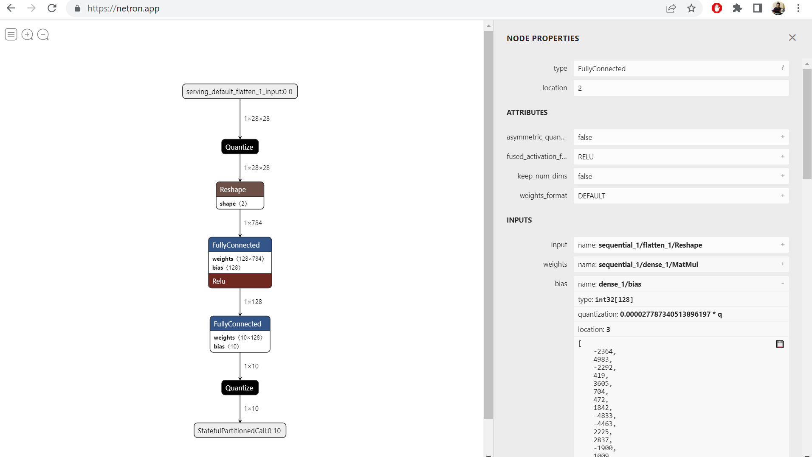

# ice40_tflite_inference

This project is an experiment. The idea is to create a simple example to 
illustrate the use of FPGA as a compute accelerator by running ML inference 
on a quantized TensorFlow Lite model on an iCE40 FPGA. 

Project Plan:

1. ✓ Create a simple TensorFlow model using the MNIST handwriting dataset.
2. ✓ Convert model to TFLite using int8 quantization.
3. ✓ Get TFLite model weights and quantization parameters using *Netron*.
4. ✓ Create a Python POC that does manual inference on data in #3. Compare 
results with FTLite interpretor on same data.
5. Implement inference using TFLite data on iCE40 FPGA. (Matrix multiplication and ReLU.)
6. Implement inference using TFLite data on RP2040 in C to compare with #5.


## Files

Here are the files in this project:

| File | Description|
|--|--|
| mnist_hr_post_training_integer_quant.ipynb | This notebook builds the model and creates the FTLite file. Runs on Google Colab.|
| inference_float32.ipynb | This notebook does manual inference on the unquantized float32 TFlite file.| 
| inference_uint8.ipynb | This notebook does manual inference on the quantized int8 TFlite file. |
| mnist_uint8 | Folder with weights from uint8 TFLite collected using Netron.|
| mnist_float32 | Folder with weights from float32 TFLite collected using Netron.|

## JSON

It's possible to extract a JSON file from the TFile file using `flatc` as follows:

```
flatc -t schema.fbs -- mnist_model_quant.tflite
```

But Netron is more convenient for saving the weight data into `.npy` files.

## Netron 

[Netron](https://netron.app/) is used to extract weights and quantization parameters from the TFLite model. As can be seen from the image below, the model consists of the following layers:

1. 28 x 28 x 1 Image input.
2. 128 unit Dense layer with ReLU.
3. 10 unit Dense layer for output.


