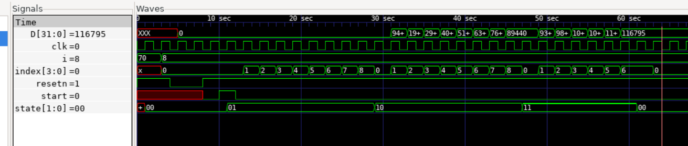

# Matrix Mutiplication


## matmul.v

Computes dot product of A and B.

D = A.B

Here:

N = 70
N = M*P + K
M = 8
P = 8
K = 6

P is the number of MAC units.

Computation happens in M + P + K cycles = 20 as opposed to a direct multiplication that will take 70 cycles.

### Simulation



### iCE40 synthesis**

```
read_verilog matmul.v
opt
synth_ice40 -dsp
```

Resources used:

```
   Number of wires:                565
   Number of wire bits:           2653
   Number of public wires:         565
   Number of public wire bits:    2653
   Number of memories:               0
   Number of memory bits:            0
   Number of processes:              0
   Number of cells:               1180
     SB_CARRY                      312
     SB_DFF                          4
     SB_DFFESR                     292
     SB_DFFSR                        4
     SB_LUT4                       560
     SB_MAC16                        8
```

