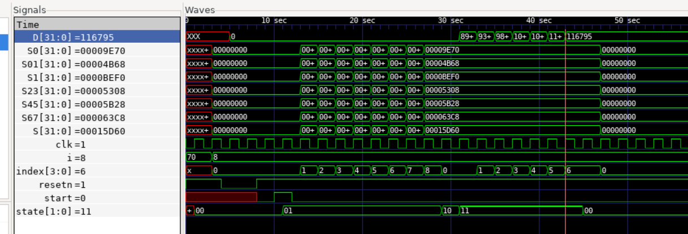

# Matrix Mutiplication


## matmul.v

Computes dot product of A and B.

D = A.B

Here:

N = 70, N = M*P + K, M = 8, P = 8, K = 6

P is the number of MAC units.

Computation happens in M + P + K cycles = 20 as opposed to a direct multiplication that will take 70 cycles.


**Simulation**


**iCE40 synthesis**

```
read_verilog matmul.v
opt
synth_ice40 -dsp
```

Resources used:

```
   Number of wires:                565
   Number of wire bits:           2653
   Number of public wires:         565
   Number of public wire bits:    2653
   Number of memories:               0
   Number of memory bits:            0
   Number of processes:              0
   Number of cells:               1180
     SB_CARRY                      312
     SB_DFF                          4
     SB_DFFESR                     292
     SB_DFFSR                        4
     SB_LUT4                       560
     SB_MAC16                        8
```

# With an Adder Tree 

Takes about 16 cycles.

**Simulation**



**iCE40 synthesis**


```
   Number of wires:                651
   Number of wire bits:           2908
   Number of public wires:         651
   Number of public wire bits:    2908
   Number of memories:               0
   Number of memory bits:            0
   Number of processes:              0
   Number of cells:               1375
     SB_CARRY                      310
     SB_DFF                          4
     SB_DFFESR                     292
     SB_DFFSR                        4
     SB_LUT4                       757
     SB_MAC16                        8
```


## make 

Without adder tree:

```
Info: Device utilisation:
Info: 	         ICESTORM_LC:   583/ 5280    11%
Info: 	        ICESTORM_RAM:     0/   30     0%
Info: 	               SB_IO:     2/   96     2%
Info: 	               SB_GB:     5/    8    62%
Info: 	        ICESTORM_PLL:     0/    1     0%
Info: 	         SB_WARMBOOT:     0/    1     0%
Info: 	        ICESTORM_DSP:     8/    8   100%
Info: 	      ICESTORM_HFOSC:     0/    1     0%
Info: 	      ICESTORM_LFOSC:     0/    1     0%
Info: 	              SB_I2C:     0/    2     0%
Info: 	              SB_SPI:     0/    2     0%
Info: 	              IO_I3C:     0/    2     0%
Info: 	         SB_LEDDA_IP:     0/    1     0%
Info: 	         SB_RGBA_DRV:     0/    1     0%
Info: 	      ICESTORM_SPRAM:     0/    4     0%
```

Info: Max frequency for clock 'clk$SB_IO_IN_$glb_clk': 31.28 MHz (PASS at 12.00 MHz)


With adder tree:

```
Info: Device utilisation:
Info: 	         ICESTORM_LC:   784/ 5280    14%
Info: 	        ICESTORM_RAM:     0/   30     0%
Info: 	               SB_IO:     2/   96     2%
Info: 	               SB_GB:     5/    8    62%
Info: 	        ICESTORM_PLL:     0/    1     0%
Info: 	         SB_WARMBOOT:     0/    1     0%
Info: 	        ICESTORM_DSP:     8/    8   100%
Info: 	      ICESTORM_HFOSC:     0/    1     0%
Info: 	      ICESTORM_LFOSC:     0/    1     0%
Info: 	              SB_I2C:     0/    2     0%
Info: 	              SB_SPI:     0/    2     0%
Info: 	              IO_I3C:     0/    2     0%
Info: 	         SB_LEDDA_IP:     0/    1     0%
Info: 	         SB_RGBA_DRV:     0/    1     0%
Info: 	      ICESTORM_SPRAM:     0/    4     0%
```
Info: Max frequency for clock 'clk$SB_IO_IN_$glb_clk': 28.93 MHz (PASS at 12.00 MHz)

